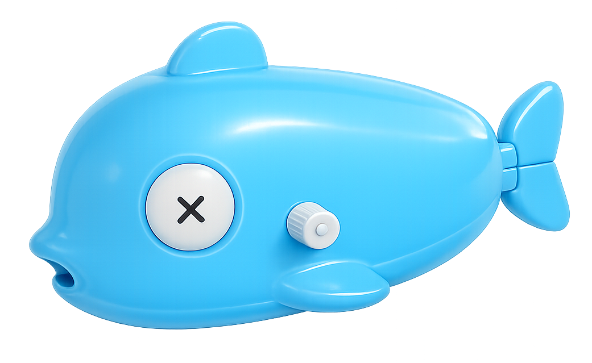

<div align="center">



<h1>drydock &nbsp;</h1>

**Open source container update monitoring — built in TypeScript with modern tooling.**

</div>

<p align="center">
  <a href="https://github.com/CodesWhat/drydock/releases"></a>
  <a href="https://github.com/orgs/CodesWhat/packages/container/package/drydock"></a>
  <a href="https://github.com/orgs/CodesWhat/packages/container/package/drydock"></a>
  <a href="LICENSE"></a>
</p>

<p align="center">
  <a href="https://github.com/CodesWhat/drydock/stargazers"></a>
  <a href="https://github.com/CodesWhat/drydock/forks"></a>
  <a href="https://github.com/CodesWhat/drydock/issues"></a>
  <a href="https://github.com/CodesWhat/drydock/commits/main"></a>
</p>

<p align="center">
  <a href="https://www.bestpractices.dev/projects/11915"></a>
  <a href="https://securityscorecards.dev/viewer/?uri=github.com/CodesWhat/drydock"></a>
  <a href="https://app.codecov.io/gh/CodesWhat/drydock"></a>
  <a href="https://app.codacy.com/gh/CodesWhat/drydock/dashboard?utm_source=gh&utm_medium=referral&utm_content=&utm_campaign=Badge_grade"></a>
  <a href="https://sonarcloud.io/summary/overall?id=CodesWhat_drydock"></a>
  <a href="https://snyk.io/test/github/CodesWhat/drydock"></a>
  <a href="https://qlty.sh/gh/CodesWhat/projects/drydock"></a>
</p>

---

## Contents

- [Quick Start](#quick-start)
- [Screenshots](#screenshots)
- [Features](#features)
- [Architecture](#architecture)
- [Supported Registries](#supported-registries)
- [Supported Triggers](#supported-triggers)
- [Authentication](#authentication)
- [Migrating from WUD](#migrating-from-wud)
- [Documentation](#documentation)
- [Built With](#built-with)

---

## Quick Start

```bash
docker run -d \
  --name drydock \
  -p 3000:3000 \
  -v /var/run/docker.sock:/var/run/docker.sock \
  ghcr.io/codeswhat/drydock:latest
```

<details>
<summary><strong>Docker Compose</strong></summary>

```yaml
services:
  drydock:
    image: ghcr.io/codeswhat/drydock:latest
    container_name: drydock
    ports:
      - "3000:3000"
    volumes:
      - /var/run/docker.sock:/var/run/docker.sock
    restart: unless-stopped
```

</details>

<details>
<summary><strong>Verify it's running</strong></summary>

```bash
# Health check
curl http://localhost:3000/health

# Open the UI
open http://localhost:3000
```

</details>

<details>
<summary><strong>If GHCR requires auth</strong></summary>

```bash
echo '<GITHUB_PAT>' | docker login ghcr.io -u <github-username> --password-stdin
docker pull ghcr.io/codeswhat/drydock:latest
```

</details>

---

## Screenshots

<p align="center">
  
</p>

<p align="center">
  
</p>

---

## Features

<table>
<tr>
<td align="center" width="33%">
<h3>Container Monitoring</h3>
Auto-detect running containers and check for image updates across registries
</td>
<td align="center" width="33%">
<h3>17 Notification Triggers</h3>
Slack, Discord, Telegram, SMTP, MQTT, HTTP webhooks, Gotify, NTFY, and more
</td>
<td align="center" width="33%">
<h3>10+ Registry Providers</h3>
Docker Hub, GHCR, ECR, GCR, GitLab, Quay, LSCR, Codeberg, DHI, and custom
</td>
</tr>
<tr>
<td align="center">
<h3>Docker Compose Updates</h3>
Auto-pull and recreate services via docker-compose with multi-network support
</td>
<td align="center">
<h3>Distributed Agents</h3>
Monitor remote Docker hosts with SSE-based agent architecture
</td>
<td align="center">
<h3>Update Policies</h3>
Skip, snooze, or threshold-filter updates per container or globally
</td>
</tr>
<tr>
<td align="center" width="33%">
<h3>OIDC Authentication</h3>
Authelia, Auth0, Authentik — secure your dashboard with OpenID Connect
</td>
<td align="center" width="33%">
<h3>Prometheus Metrics</h3>
Built-in /metrics endpoint with optional auth bypass for monitoring stacks
</td>
<td align="center" width="33%">
<h3>In-App Log Viewer</h3>
Browse application logs directly in the web UI
</td>
</tr>
</table>

---

## Architecture

> For the full itemized changelog, see [CHANGELOG.md](CHANGELOG.md).

| | WUD | drydock |
|---|---|---|
| **Language** | JavaScript | TypeScript (ESM, `NodeNext`) |
| **Test runner** | Jest | Vitest 4 |
| **Linter** | ESLint + Prettier | Biome |
| **Express** | 4.x | 5.x |
| **Build system** | Babel | `tsc` (no transpiler) |

### drydock-Only Features

| Feature | Description |
|---------|-------------|
| **Agent mode** | Distributed monitoring with remote agents over SSE |
| **OIDC token lifecycle** | Bearer/Basic auth for remote watcher HTTPS connections |
| **Container update policy** | Skip/snooze specific versions per container via API and UI |
| **Metrics auth toggle** | `DD_SERVER_METRICS_AUTH=false` to expose `/metrics` without auth |
| **NTFY provider-level threshold** | Set threshold at the ntfy provider level, not just per-trigger |
| **Docker pull progress logging** | Rate-limited pull progress during compose updates |
| **Registry lookup image override** | `lookupImage` field to override tag lookup image |
| **DHI registry** | `dhi.io` registry provider |
| **Custom URL icons** | URL-based icons via `dd.display.icon` label |
| **Version skip UI** | Skip specific versions from the web interface |
| **In-app log viewer** | Browse logs in the UI |
| **Semver tag recovery** | Recover mismatched semver tags from include filters |
| **Per-image config presets** | `imgset` defaults for per-image configuration |

### Bug Fixes (not in WUD)

| Fix | Impact |
|-----|--------|
| `eval()` code injection | Replaced with safe `String.replace()` interpolation |
| OIDC session state races | Serialized redirect checks, multiple pending states |
| Docker event stream crash | Buffered split payloads before JSON parse |
| Multi-network container recreate | Reconnects additional networks after recreation |
| docker-compose post_start hooks | Hooks now execute after updates |
| Express 5 wildcard routes | Named wildcard params for Express 5 compat |

---

## Supported Registries

<details>
<summary><strong>Public registries</strong> (auto-registered, no config needed)</summary>

| Registry | Provider | URL |
|----------|----------|-----|
| Docker Hub | `hub` | `hub.docker.com` |
| GitHub Container Registry | `ghcr` | `ghcr.io` |
| Google Container Registry | `gcr` | `gcr.io` |
| Quay | `quay` | `quay.io` |
| LinuxServer (LSCR) | `lscr` | `lscr.io` |
| DigitalOcean | `docr` | `registry.digitalocean.com` |
| Codeberg | `codeberg` | `codeberg.org` |
| DHI | `dhi` | `dhi.io` |
| Amazon ECR Public | `ecr` | `public.ecr.aws` |

</details>

<details>
<summary><strong>Private registries</strong> (require credentials)</summary>

| Registry | Provider | Env vars |
|----------|----------|----------|
| Docker Hub | `hub` | `DD_REGISTRY_HUB_{name}_LOGIN`, `_TOKEN` |
| Amazon ECR | `ecr` | `DD_REGISTRY_ECR_{name}_ACCESSKEYID`, `_SECRETACCESSKEY`, `_REGION` |
| Azure ACR | `acr` | `DD_REGISTRY_ACR_{name}_CLIENTID`, `_CLIENTSECRET` |
| GitLab | `gitlab` | `DD_REGISTRY_GITLAB_{name}_TOKEN` |
| GitHub (GHCR) | `ghcr` | `DD_REGISTRY_GHCR_{name}_TOKEN` |
| Gitea / Forgejo | `gitea` | `DD_REGISTRY_GITEA_{name}_LOGIN`, `_PASSWORD` |
| Custom (any v2) | `custom` | `DD_REGISTRY_CUSTOM_{name}_URL` + optional auth |

See [Registry docs](docs/configuration/registries/README.md) for full configuration.

</details>

---

## Supported Triggers

<details>
<summary><strong>Notification triggers</strong> (17 providers)</summary>

All env vars use the `DD_` prefix; Docker labels use the `dd.` prefix.

| Trigger | Description | Docs |
|---------|-------------|------|
| Apprise | Universal notification gateway | [docs](docs/configuration/triggers/apprise/README.md) |
| Command | Run arbitrary shell commands | [docs](docs/configuration/triggers/command/README.md) |
| Discord | Discord webhook | [docs](docs/configuration/triggers/discord/README.md) |
| Docker | Auto-pull and restart containers | [docs](docs/configuration/triggers/docker/README.md) |
| Docker Compose | Auto-pull and recreate compose services | [docs](docs/configuration/triggers/docker-compose/README.md) |
| Gotify | Gotify push notifications | [docs](docs/configuration/triggers/gotify/README.md) |
| HTTP | Generic webhook (POST) | [docs](docs/configuration/triggers/http/README.md) |
| IFTTT | IFTTT applet trigger | [docs](docs/configuration/triggers/ifttt/README.md) |
| Kafka | Kafka message producer | [docs](docs/configuration/triggers/kafka/README.md) |
| MQTT | MQTT message (Home Assistant compatible) | [docs](docs/configuration/triggers/mqtt/README.md) |
| NTFY | ntfy.sh push notifications | [docs](docs/configuration/triggers/ntfy/README.md) |
| Pushover | Pushover notifications | [docs](docs/configuration/triggers/pushover/README.md) |
| Rocket.Chat | Rocket.Chat webhook | [docs](docs/configuration/triggers/rocketchat/README.md) |
| Slack | Slack webhook | [docs](docs/configuration/triggers/slack/README.md) |
| SMTP | Email notifications | [docs](docs/configuration/triggers/smtp/README.md) |
| Telegram | Telegram bot messages | [docs](docs/configuration/triggers/telegram/README.md) |

All triggers support **threshold filtering** (`all`, `major`, `minor`, `patch`) to control which updates fire notifications.

</details>

---

## Authentication

<details>
<summary><strong>Supported auth methods</strong></summary>

| Method | Description | Docs |
|--------|-------------|------|
| Anonymous | No auth (default) | — |
| Basic | Username + password hash | [docs](docs/configuration/authentications/basic/README.md) |
| OIDC | OpenID Connect (Authelia, Auth0, Authentik) | [docs](docs/configuration/authentications/oidc/README.md) |

</details>

---

## Migrating from WUD

drydock is a drop-in replacement for [What's Up Docker (WUD)](https://github.com/getwud/wud). Switch only the image reference — everything else stays the same:

```diff
- image: getwud/wud:8.1.1
+ image: ghcr.io/codeswhat/drydock:latest
```

**Full backwards compatibility is built in.** You do not need to rename anything in your compose file, environment, or labels:

| WUD (legacy) | drydock (new) | Status |
|---|---|---|
| `WUD_` env vars | `DD_` env vars | Both work — `WUD_` vars are automatically mapped to their `DD_` equivalents at startup. If both are set, `DD_` takes priority. |
| `wud.*` container labels | `dd.*` container labels | Both work — all `wud.*` labels (`wud.watch`, `wud.tag.include`, `wud.display.name`, etc.) are recognized alongside their `dd.*` counterparts. |
| `/store/wud.json` state file | `/store/dd.json` state file | Automatic migration — on first start, if `wud.json` exists and `dd.json` does not, drydock renames it in place. No data loss. |
| Docker socket mount | Docker socket mount | Unchanged — same `/var/run/docker.sock` bind mount. |
| Health endpoint `/health` | Health endpoint `/health` | Unchanged — same path, same port (default 3000). |

**In short:** swap the image, restart the container, done. Your watchers, triggers, registries, and authentication config all carry over with zero changes.

---

## Documentation

| Resource | Link |
|----------|------|
| Docs | [`docs/README.md`](docs/README.md) |
| Configuration | [`docs/configuration/README.md`](docs/configuration/README.md) |
| Quick Start | [`docs/quickstart/README.md`](docs/quickstart/README.md) |
| Changelog | [`CHANGELOG.md`](CHANGELOG.md) |
| Issues | [GitHub Issues](https://github.com/CodesWhat/drydock/issues) |

---

<div align="center">

### Built With

[](#)
[](#)
[](#)
[](#)
[](#)
[](#)
[](#)

---

**[MIT License](LICENSE)**

<a href="#drydock">Back to top</a>

</div>
