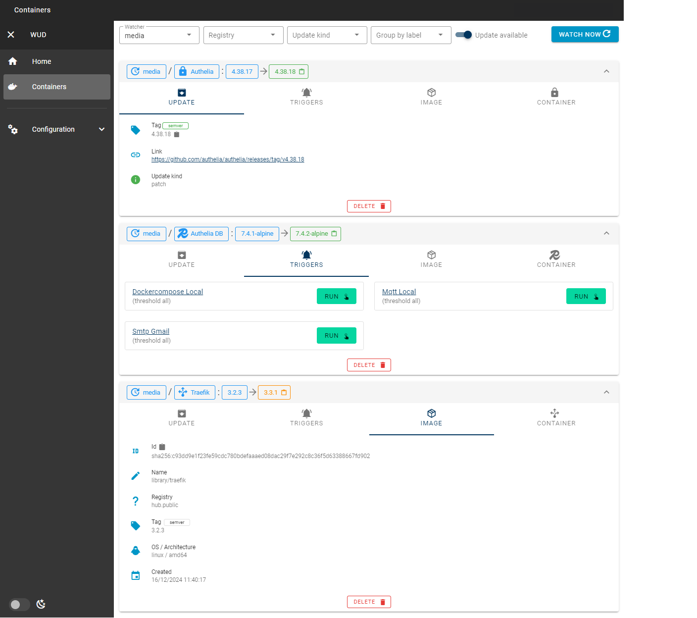

# Introduction

## upDocker <small>(aka ***What's upDocker?***)</small>

Keep your containers up-to-date!

#### Overview

`WATCHERS` scan Docker hosts to discover containers to watch

`REGISTRIES` query remote Docker registries to find update candidates

`TRIGGERS` perform actions when updates are available

## Supported triggers

Many triggers are supported.

Some are intended to notify (mail, notification...).

Some are intended to update the containers (docker-compose...).

Some are intended to do whatever you want (script, webhook, messaging...).

?> [See here the full trigger list](configuration/triggers/)

## Supported registries

Many registries are supported.

- [**Azure Container Registry**](https://azure.microsoft.com/services/container-registry)
- [**AWS Elastic Container Registry**](https://aws.amazon.com/ecr)
- [**Google Container Registry**](https://cloud.google.com/container-registry)
- [**Github Container Registry**](https://docs.github.com/en/packages/working-with-a-github-packages-registry/working-with-the-docker-registry)
- [**Docker Hub (public & private repositories)**](http://hub.docker.com)
- ...

?> [See here the full registry list](configuration/registries/)

?> [Self hosted registries are also supported](configuration/registries/custom/)

## UI / API

A Web UI allows to get container insights and to manually run the triggers.

## Integration

`upDocker` is meant to play nicely with your favorite tools.

- [**Home-Assistant**](https://www.home-assistant.io/)
- [**Prometheus**](https://prometheus.io/)
- [**Grafana**](https://grafana.com/)
- [**Authelia**](https://www.authelia.com/)
- ...

## Ready to go?
> [**Follow the quick start guide!**](quickstart/)

## Contact & Support
- Create a [GitHub issue](https://github.com/CodesWhat/updocker/issues) for bug reports, feature requests, or questions
- Add a [:star: on GitHub](https://github.com/CodesWhat/updocker) to support the project!

## License
This project is licensed under the [MIT license](https://github.com/CodesWhat/updocker/blob/main/LICENSE).
