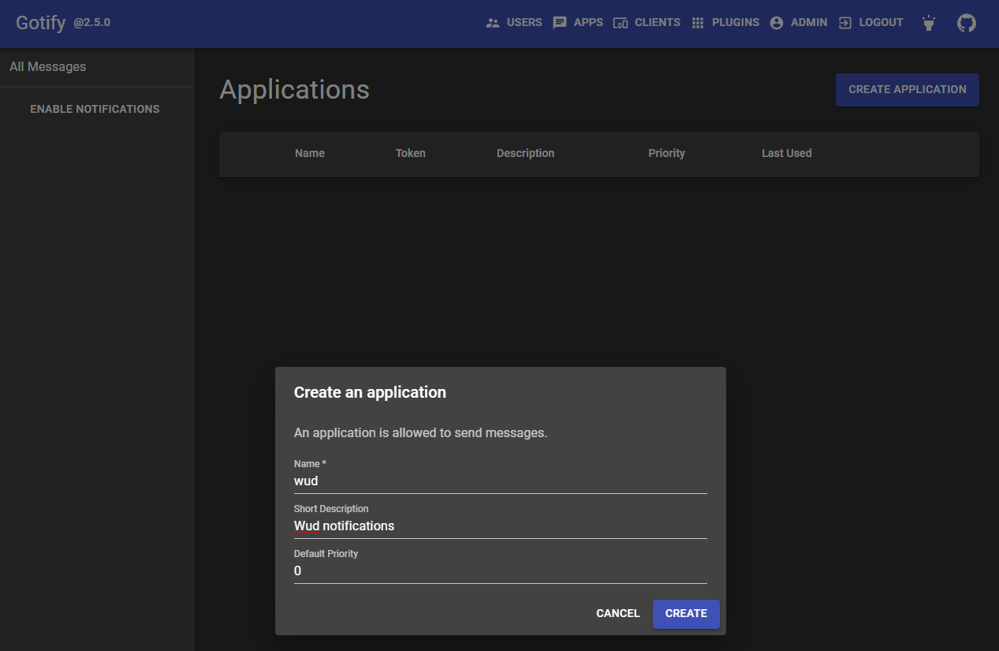
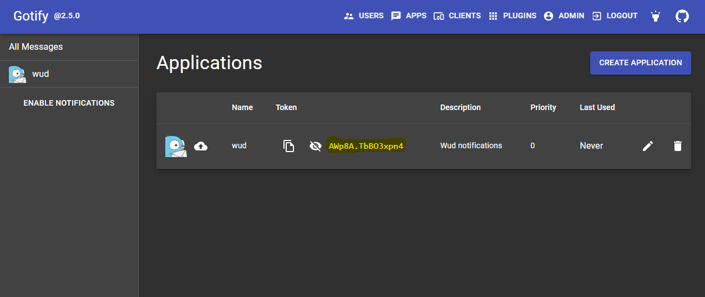

# Gotify


The `gotify` trigger lets you send container update notifications via [Gotify](https://gotify.net/).

### Variables

| Env var                                      |    Required    | Description                 | Supported values                            | Default value when missing |
|----------------------------------------------|:--------------:|-----------------------------|---------------------------------------------|----------------------------| 
| `WUD_TRIGGER_GOTIFY_{trigger_name}_PRIORITY` | :white_circle: | The Gotify message priority | Integer greater or equal than `0`           |                            |
| `WUD_TRIGGER_GOTIFY_{trigger_name}_TOKEN`    | :red_circle:   | The Gotify app token url    | A valid gotify app token                    |                            |
| `WUD_TRIGGER_GOTIFY_{trigger_name}_URL`      | :red_circle:   | The Gotify server url       | The `http` or `https` gotify server address |                            |

?> This trigger also supports the [common configuration variables](configuration/triggers/?id=common-trigger-configuration).

### Examples

#### Create an app on Gotify


#### Get the Gotify app token


#### Configure the trigger

<!-- tabs:start -->
#### **Docker Compose**
```yaml
services:
  updocker:
    image: ghcr.io/codeswhat/updocker
    ...
    environment:
      - WUD_TRIGGER_GOTIFY_LOCAL_URL=http://gotify.localhost
      - WUD_TRIGGER_GOTIFY_LOCAL_TOKEN=AWp8A.TbBO3xpn4
```
#### **Docker**
```bash
docker run \
  -e WUD_TRIGGER_GOTIFY_LOCAL_URL="http://gotify.localhost" \
  -e WUD_TRIGGER_GOTIFY_LOCAL_TOKEN="AWp8A.TbBO3xpn4" \
  ...
  ghcr.io/codeswhat/updocker
```
<!-- tabs:end -->
